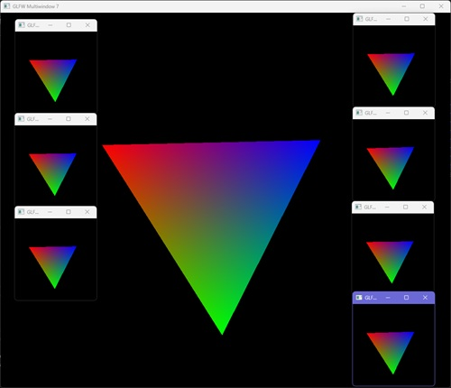

# GLFW for Node.js

This is a part of [Node3D](https://github.com/node-3d) project.

[](https://www.npmjs.com/package/glfw-raub)

[](https://travis-ci.com/node-3d/glfw-raub)
[](https://www.codefactor.io/repository/github/node-3d/glfw-raub)


## Synopsis

**Node.js** addon with **GLFW3** bindings.



* Exposes low-level **GLFW** interface.
* Multiple windows for a single **Node.js** process - easy.
* Goes fullscreen and back fluently.
* Has `Document` class, capable of tricking other libs, as if we are in a browser.

> Note: for `npm i` to succeed, compilation tools must be in place on your system.
For Windows, use **ADMIN PRIVELEGED** command line:
`npm i -g windows-build-tools`.
Also **Windows** needs **vcredist 2013** to be installed.


## Usage

This is a rather low level interface, where most of the stuff is directly reflecting
GLFW interfaces. Do not expect much. See [GLFW Docs](http://www.glfw.org/docs/latest/group__window.html)
for useful info on what it does and doesn't.

As per this lib, 3 entities are exported: GLFW itself, and Window and Document classes.

```js
const glfw = require('glfw-raub');
const { Window, Document } = glfw;
```

Here `glfw` is a low level interface container, where all `glfw*` functions are accessible as
`glfw.*`. E.g. `glfwSetWindowTitle` -> `glfw.setWindowTitle`.

`glfw.createWindow(w, h, emitter, title, display)` - this function differs from GLFW Docs
signature due to JS specifics. Here `emitter` is any object having **BOUND** `emit()` method.
It will be used to transmit GLFW events.

----------


### GLFW window events:

* `'blur'` - window [focus lost](https://developer.mozilla.org/en-US/docs/Web/Events/blur)
* `'click'` - mouse button [clicked](https://developer.mozilla.org/en-US/docs/Web/Events/click)
* `'drop'` - drag-[dropped](https://developer.mozilla.org/en-US/docs/Web/Events/drop) some files on the window
* `'focus'` - window [focus gained](https://developer.mozilla.org/en-US/docs/Web/Events/focus)
* `'focusin'` - window [focus gained](https://developer.mozilla.org/en-US/docs/Web/Events/focusin)
* `'focusout'` - window [focus lost](https://developer.mozilla.org/en-US/docs/Web/Events/focusout)
* `'fbresize'` - render-surface resized `{ width, height }`
* `'iconifiy'` - window was iconified
* `'keydown'` - keyboard [key down](https://developer.mozilla.org/en-US/docs/Web/Events/keydown)
* `'keyup'` - keyboard [key up](https://developer.mozilla.org/en-US/docs/Web/Events/keyup)
* `'mousedown'` - mouse [button down](https://developer.mozilla.org/en-US/docs/Web/Events/mousedown)
* `'mouseenter'` - mouse [entered](https://developer.mozilla.org/en-US/docs/Web/Events/mouseenter) the window
* `'mouseleave'` - mouse [left](https://developer.mozilla.org/en-US/docs/Web/Events/mouseleave) the window
* `'mouseup'` - mouse [button up](https://developer.mozilla.org/en-US/docs/Web/Events/mouseup)
* `'quit'` - window closed
* `'refresh'` - window needs to be redrawn
* `'resize'` - window frame resized `{ width, height }`
* `'wheel'` - mouse [wheel rotation](https://developer.mozilla.org/en-US/docs/Web/Events/wheel)
* `'move'` - window moved `{ x, y }`

> Note: `keypress` event is not supported.


### class Window

`Window` is higher level js-wrapper around the above functions, which helps in managing window
instances. It basically has all the functionality where in GLFW Docs `window` parameter
is mentioned. E.g. `glfwSetWindowTitle(window, title)` -> `window.title = title`.

There are few simple rules for the above transformation to become intuitive:

* API is available if it has `window` parameter.
* All props start lowercase.
* Word "Window" is omitted.
* Whatever could have a `get/set` interface is made so.


Constructor:

* `Window({ title, width, height, display, vsync, mode, autoIconify, msaa })`
	* `string title $PWD` - window title, takes current directory as default.
	* `number width 800` - window initial width.
	* `number height 600` - window initial height.
	* `number display undefined` - display id to open window on a specific display.
	* `boolean vsync false` - if vsync should be used.
	* `string mode 'windowed'` - one of `'windowed', 'borderless', 'fullscreen'`.
	* `boolean autoIconify true` - if fullscreen windows should iconify automatically on focus loss.
	* `number msaa 2` - multisample antialiasing level.
	* `boolean decorated true` - if window has borders (use `false` for borderless fullscreen).


Properties:

* `get number handle` - window pointer.
* `get string version` - OpenGL vendor info.
* `get number platformWindow` - window HWND pointer.
* `get number platformContext` - OpenGL context handle.
* `get {width, height} framebufferSize` - the size of allocated framebuffer.
* `get number currentContext` - what GLFW window is now current.
* `get number samples` - number of msaa samples passed to the constructor.

* `get/set string mode` - one of `'windowed', 'borderless', 'fullscreen'`. Here
`'borderless'` emulates fullscreen by a frameless, screen-sized window.
This when this property is changed, a new window is created and the old is hidden.
* `get/set number width|w` - window width.
* `get/set number height|h` - window height.
* `get/set [width, height] wh` - window width and height.
* `get/set {width, height} size` - window width and height.
* `get/set string title` - window title.
* `get/set {width, height, Buffer data} icon` - window icon in RGBA format. Consider
using [this Image implementation](https://github.com/raub/node-image).
* `get/set boolean shouldClose` - if window is going to be closed.
* `get/set number x` - window position X-coordinate on the screen.
* `get/set number y` - window position Y-coordinate on the screen.
* `get/set {x, y} pos` - where window is on the screen.
* `get/set {x, y} cursorPos` - where mouse is relative to the window.

---

Methods:

* `getKey(number key)` - `glfw.getKey(window, key)`.
* `getMouseButton(number button)` - `glfw.getMouseButton(window, button)`.
* `getWindowAttrib(number attrib)` - `glfw.getWindowAttrib(window, attrib)`.
* `setInputMode(number mode)` - `glfw.setInputMode(window, mode)`.
* `swapBuffers()` - `glfw.swapBuffers(window)`.
* `makeCurrent()` - `glfw.makeContextCurrent(window)`.
* `destroy()` - `glfw.destroyWindow(window)`.
* `iconify()` - `glfw.iconifyWindow(window)`.
* `restore()` - `glfw.restoreWindow(window)`.
* `hide()` - `glfw.hideWindow(window)`.
* `show()` - `glfw.showWindow(window)`.
* `on(string type, function cb)` - listen for window (GLFW) events.


----------

### class Document

`Document` extends `Window` to provide an additional web-style compatibility layer.
As name suggests, objects of such class will mimic the behavior and properties of
your typical browser `window.document`. But also it is a `Window`, at the same time.
And it is incomplete at this point: you still have to provide an `Image` class of
your choice and WebGL context (implementation). Two static methods are designated
for this:

* static setImage(Image) - for example,
[this Image implementation](https://github.com/raub/node-image)
is designed to fit perfectly. Also sets `global.HTMLImageElement`.

* static setWebgl(webgl) - for example,
[this WebGL implementation](https://github.com/raub/node-webgl)
is designed to fit perfectly.


Constructor:

* `Document({ ...<Window opts>, ignoreQuit, autoFullscreen })`
	* `boolean ignoreQuit false` - if the window should ignore the default quit signals, e.g. ESC key.
	* `boolean autoFullscreen false` - if window has default key handlers for fullscreen:
		* CTRL+F - borderless fullscreen window.
		* CTRL+ALT+F - real, exclusive fullscreen mode.
		* CTRL+SHIFT+F - back to windowed.


Properties:

* `get body` - returns `this`.
* `get ratio/devicePixelRatio` - device pixel ratio, most likely to be 1.
* `get/set innerWidth/clientWidth` - window width.
* `get/set innerHeight/clientHeight` - window height.
* `get/set onkeydown` - browser-style event listening.
* `get/set onkeyup` - browser-style event listening.
* `get style` - mimic web-element `style` property.
* `get context` - returns `Document.webgl`, set through `Document.setWebgl`.


Methods:

* `getContext()` - returns `Document.webgl`, set through `Document.setWebgl`.
* `getElementById(id)` - returns `this`.
* `getElementsByTagName(tag)` - if contains 'canvas', returns `this`, otherwise `null`.
* `createElementNS(_0, name)` - returns the result of `createElement(name)`.
* `createElement(name)` - for `'canvas'` returns `this` for *the first call*,
then returns new instances of canvas-like object capable of using 2d or 3d context.
This is done for some web APIs like three.js, which create additional canvases.
For `'image'` returns `new Document.Image`, set through `Document.setImage`.
* `dispatchEvent(event)` - invokes `emit(event.type, event)`.
* `addEventListener(name, callback)` - adds event listener.
* `removeEventListener(name, callback)` - removes event listener.
* `requestAnimationFrame(cb)` - **BOUND** `requestAnimationFrame` method.
